# 판례 텍스트 기반 사건 유형 자동 분류: 텍스트 표현 방식별 성능 비교 연구

**2026학년도 1학기 빅데이터프로그래밍 (A분반) · 팀 레옹**
정래원 · 김동현 · 김홍근 · 이승준 · 이윤수

---

## 초록 (Abstract)

**연구 목적**

본 연구는 법원 판례 텍스트를 10개 사건 유형으로 자동 분류할 때, **텍스트 표현 방식(희소 빈도 · 학습 임베딩 · 사전학습 문맥)** 에 따라 성능이 어떻게 달라지는지 비교한다.

**데이터 및 실험 설계**

* AI Hub 「상황에 따른 판례」 **42,601건** → train 34,080 / val 4,260 / **test 4,261**
* 입력: 판시사항 + 요약문 **결합 텍스트** (모든 모델 동일)
* 평가: **Macro F1** (클래스 불균형 최대 56배 → Accuracy 단독 사용 불가)
* 비교 모델 5종: TF-IDF+LR · TF-IDF+SVM · TextCNN · KLUE-BERT(frozen)+MLP · Late Fusion

**주요 결과 (test 4,261건 기준)**

* Baseline TF-IDF+SVM: Macro F1 **0.6347**
* TextCNN: **0.6556** → baseline **상회** (+0.021)
* Late Fusion (α=0.8): **0.6561** → baseline **상회**, **최고 성능**
* BERT+MLP 단독: **0.5792** → baseline **미달** (−0.056)

**시사점**

* 학습 임베딩(TextCNN)과 앙상블(Late Fusion)은 전통 ML을 능가했으나, frozen BERT+MLP 단독은 baseline에 못 미쳤다.
* BERT 계열은 **Late Fusion에서 LR과 결합**할 때 baseline 이상으로 끌어올려지며(+0.077 vs BERT+MLP 단독), 단독 분류기보다 **앙상블 보조 신호**로 더 적합했다.
* 특허/저작권(F1 0.91+)은 모든 모델에서 높은 반면, 기업·형사A/B 등 **의미 인접 클래스**는 표현 방식과 무관하게 지속적으로 혼동되었다.

**주제어**: 텍스트 분류, 판례 데이터, TF-IDF, TextCNN, BERT, Late Fusion, 클래스 불균형, Macro F1

---

## 목차

1. [서론](#1-서론)
2. [관련 연구 및 배경 지식](#2-관련-연구-및-배경-지식)
3. [데이터셋](#3-데이터셋)
4. [탐색적 데이터 분석 (EDA)](#4-탐색적-데이터-분석-eda)
5. [연구 방법](#5-연구-방법)
6. [실험 결과](#6-실험-결과)
7. [논의](#7-논의)
8. [한계 및 향후 과제](#8-한계-및-향후-과제)
9. [결론](#9-결론)
10. [재현 방법 (Reproducibility)](#10-재현-방법-reproducibility)
11. [팀 구성 및 역할](#11-팀-구성-및-역할)
- [참고문헌](#참고문헌)
- [부록 A. 트러블슈팅 기록](#부록-a-트러블슈팅-기록)

---

## 1. 서론

### 1.1 연구 배경

법률 정보는 매년 방대한 양으로 축적되지만, 판례를 사건 유형별로 분류·검색하는 작업은 여전히 전문 인력의 수작업에 의존하는 경우가 많다. 판례 텍스트를 사건 유형(민사·형사·행정 등)으로 자동 분류할 수 있다면, 법률 검색 시스템·판례 추천·법률 상담 챗봇 등 다양한 응용의 기반 기술이 된다. 그러나 판례 텍스트는 (1) 도메인 특화 용어가 많고, (2) 사건 유형 간 의미 경계가 모호하며, (3) 유형별 데이터 양이 크게 불균형하다는 점에서 일반 텍스트 분류보다 까다롭다.

### 1.2 문제 정의

본 연구가 푸는 문제는 다음과 같다.

> **입력**: 판례 한 건의 텍스트(판시사항 `jdgmn` + 요약문 `summ_pass` 결합)
> **출력**: 10개 사건 유형 중 하나(가사, 개인정보/ICT, 근로자, 금융조세, 기업, 민사, 특허/저작권, 행정, 형사A(생활형), 형사B(일반형))

이는 **단일 라벨 다중 클래스 분류(single-label multi-class classification)** 문제이다.

### 1.3 연구 질문 및 가설

중간발표 후 교수 피드백을 반영하여 연구 질문을 다음과 같이 재정의하였다.

| 가설 | 내용 |
|---|---|
| **H1** | 텍스트 표현 방식(희소 빈도 vs 학습 임베딩 vs 사전학습 문맥)에 따라 분류 성능에 유의미한 차이가 있다. |
| **H2** | 판시사항·요약문을 **결합**한 입력이 단일 텍스트 입력보다 우수하다. |
| **H3** | 어휘 신호(TF-IDF)와 문맥 신호(BERT)를 결정 단계에서 결합한 **Late Fusion 앙상블**이 단일 모델보다 우수하다. |

### 1.4 기여

- 동일 데이터·동일 입력·동일 지표(Macro F1) 하에서 **계열이 다른 5개 모델을 공정하게 비교**하였다.
- BERT를 **Frozen Feature Extractor**로 사용하여, fine-tuning으로 인한 불공정 비교를 배제하고 "표현 방식 자체"의 효과를 측정하였다.
- 차원이 다른 두 신호를 직접 연결(Early Fusion)하지 않고 **확률 단계에서 가중 결합(Late Fusion)** 하여, 차원 충돌 없이 어휘·문맥 신호를 결합하는 실용적 방법을 제시하였다.

---

## 2. 관련 연구 및 배경 지식

### 2.1 텍스트 표현 방식의 세 계열

| 계열 | 대표 기법 | 핵심 아이디어 | 한계 |
|---|---|---|---|
| **희소 빈도** | TF-IDF | 단어 등장 빈도를 가중치로 벡터화 | 단어 순서·문맥 무시 |
| **학습 임베딩** | word2vec/fastText + CNN | 단어를 밀집 벡터로 학습, 지역 n-gram 패턴 포착 | 장거리 문맥 약함 |
| **사전학습 문맥** | BERT | 대규모 코퍼스로 사전학습된 양방향 문맥 표현 | 계산 비용 큼 |

본 연구는 이 세 계열을 모두 포함하여 표현 방식이 성능에 미치는 영향을 직접 비교한다.

### 2.2 핵심 개념 요약

- **TF-IDF (Term Frequency–Inverse Document Frequency)**: 특정 문서에 자주 나오면서 전체 문서에는 드물게 나오는 단어에 높은 가중치를 부여하는 고전적 텍스트 벡터화 방법.
- **TextCNN**: 단어 임베딩 시퀀스에 1D 합성곱(kernel size 3·4·5)을 적용해 n-gram 패턴을 추출하고 max-pooling으로 요약하는 분류 모델.
- **KLUE-BERT**: 한국어 코퍼스로 사전학습된 BERT 계열 모델. 본 연구에서는 가중치를 **고정(frozen)** 하고 `[CLS]` 토큰의 768차원 벡터만 특징으로 추출한다.
- **Late Fusion**: 서로 다른 모델을 각각 학습시킨 뒤 **예측 확률을 가중 평균**하여 최종 결정을 내리는 앙상블 기법.
- **Macro F1**: 클래스별 F1 점수를 단순 평균한 값. 다수 클래스에 좌우되지 않아 **클래스 불균형 환경의 핵심 지표**이다.

---

## 3. 데이터셋

### 3.1 출처 및 규모

- **출처**: AI Hub — 「상황에 따른 판례」 데이터
- **원본 규모**: 약 66,511건 (Training 53,209건 + Validation 6,651건)
- **분류 대상**: 10개 사건 유형

### 3.2 전처리 파이프라인

| 단계 | 처리 내용 | 결과 |
|---|---|---|
| ① JSON → CSV | `jdgmn`, `summ_pass`, `class_name` 3개 필드만 추출 | 59,860건 |
| ② 결측치 제거 | 세 필드 중 하나라도 비면 제거 | **42,601건** (17,259건 제거) |
| ③ 텍스트 정제 | 반복 줄바꿈·연속 공백 정리, 앞뒤 공백 제거 | — |
| ④ 라벨 인코딩 | 문자열 카테고리 → 정수 0~9, `label_mapping.csv` 저장 | 10개 클래스 |
| ⑤ 데이터 분할 | train 80% / val 10% / test 10%, **stratify**, `random_state=42` | 아래 표 |
| 재현 스크립트 | `preprocess/make_processed_data.py` | JSON→CSV (원본 별도 다운로드) |

### 3.3 분할 결과

| 분할 | 건수 |
|---|---|
| 원본 JSON | 59,860 |
| 결측치 제거 후 | 42,601 |
| **Train** | **34,080** |
| **Validation** | **4,260** |
| **Test** | **4,261** |

### 3.4 클래스 분포 및 불균형

| 카테고리 | 라벨 | Train 건수 | 비율 |
|---|:--:|---:|---:|
| 민사 | 5 | 12,195 | 35.8% |
| 형사B(일반형) | 9 | 4,907 | 14.4% |
| 행정 | 7 | 4,713 | 13.8% |
| 형사A(생활형) | 8 | 4,238 | 12.4% |
| 금융조세 | 3 | 2,164 | 6.4% |
| 특허/저작권 | 6 | 2,136 | 6.3% |
| 근로자 | 2 | 1,368 | 4.0% |
| 기업 | 4 | 1,110 | 3.3% |
| 가사 | 0 | 1,030 | 3.0% |
| 개인정보/ICT | 1 | 219 | 0.6% |

> ⚠️ **클래스 불균형**: 최다 민사(35.8%) ↔ 최소 개인정보/ICT(0.6%) → **약 56배** 차이.
> 이에 따라 학습 시 `class_weight='balanced'`를 적용하고, 평가는 **Macro F1을 우선 지표**로 사용한다.

---

## 4. 탐색적 데이터 분석 (EDA)

> 노트북: [`EDA/EDA.ipynb`](EDA/EDA.ipynb)

### 4.1 클래스 분포

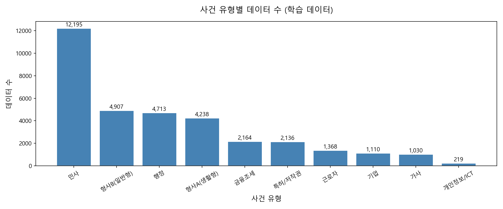

민사가 압도적 다수, 개인정보/ICT가 최소로 나타나 클래스 불균형이 시각적으로 확인된다.

### 4.2 텍스트 길이 분포

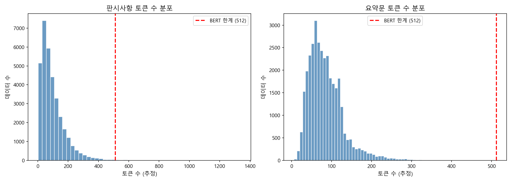

판시사항이 요약문보다 평균적으로 길며, 일부 문서는 **BERT의 512 토큰 한계를 초과**한다. 이는 입력 잘림(truncation) 처리의 근거가 된다(단, 분류 단계의 핵심 설계 근거로는 사용하지 않음 — 5.3 참조).

### 4.3 카테고리별 텍스트 길이

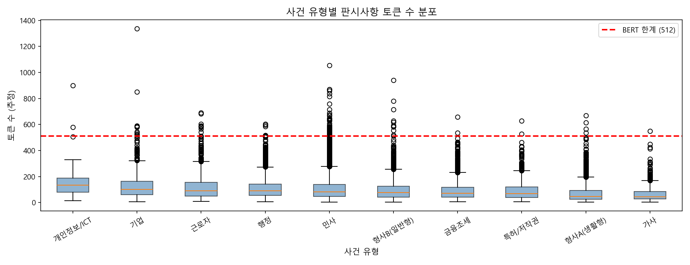

### 4.4 카테고리 간 유사도

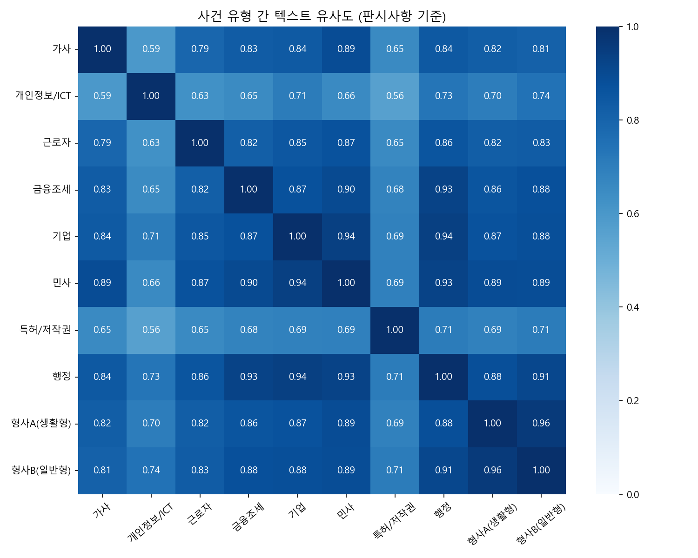

TF-IDF 코사인 유사도 기준, **형사A ↔ 형사B**, **기업 ↔ 민사** 등 의미가 인접한 클래스 쌍이 식별된다. 이는 후술할 오분류 패턴을 예고한다.

### 4.5 카테고리별 대표 키워드

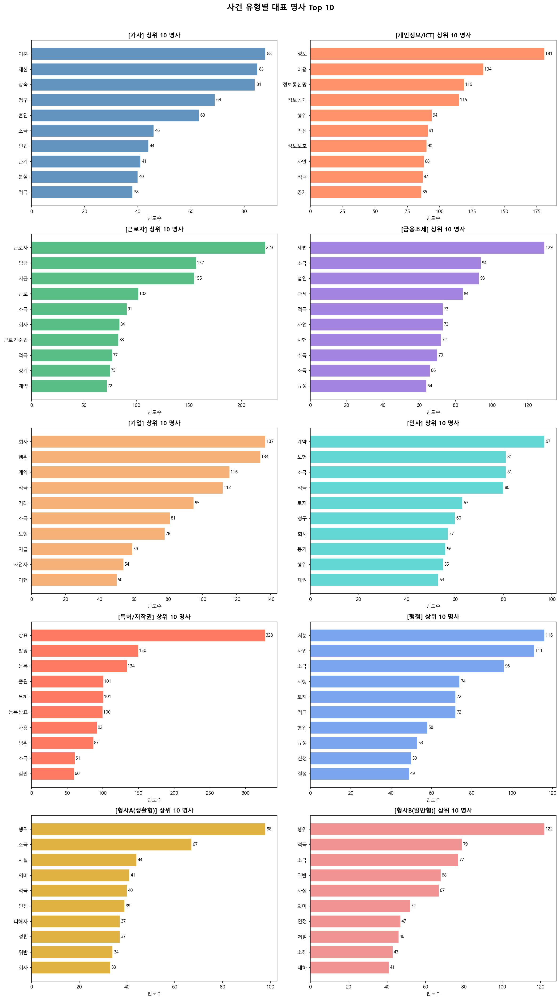

KoNLPy(Okt)로 명사를 추출한 결과, **특허/저작권** 등 일부 클래스는 도메인 특화 용어의 변별력이 매우 높다.

### 4.6 EDA 종합 인사이트

1. **클래스 불균형이 심각** → 가중치 보정·Macro F1 필요
2. **유사 카테고리 존재** → 형사A/B, 기업/민사 변별이 어려울 것으로 예상
3. **도메인 용어 변별력 차이** → 특허/저작권은 쉬운 클래스, 형사 계열은 어려운 클래스

---

## 5. 연구 방법

### 5.1 실험 설계 개요

모든 모델은 **결합 입력**(`jdgmn + ' ' + summ_pass`)을 동일하게 사용하며, 평가 지표도 동일하게 통일하였다.

| # | 모델 | 계열 | 표현 방식 |
|:--:|---|---|---|
| 1 | TF-IDF + Logistic Regression | 전통 ML | 희소·어휘 빈도 |
| 2 | TF-IDF + SVM (LinearSVC) | 전통 ML | 희소·어휘 빈도 |
| 3 | TextCNN | 딥러닝 | 학습 임베딩 + n-gram |
| 4 | KLUE-BERT(frozen) + MLP | 딥러닝 | 사전학습 문맥 |
| 5 | Late Fusion (TF-IDF+LR ⊕ BERT+MLP) | 앙상블 | 어휘 + 문맥 |

> 구도: **전통 ML 2 / 딥러닝 2 / 앙상블 1** → 계열별 공정 비교
> **Fine-tuning은 수행하지 않으며**, BERT는 Frozen Feature Extractor로만 사용한다.

### 5.2 베이스라인: TF-IDF + LR / SVM

> 노트북: [`baseline/baseline.ipynb`](baseline/baseline.ipynb)

- **입력 3종(판시사항/요약문/결합) × 모델 2종 = 6개 실험**으로 입력 조건 비교(H2 검증)
- 공통: `class_weight='balanced'`, `max_features=10000`
- GridSearchCV로 하이퍼파라미터 튜닝

**입력 조건별 결과 (Macro F1):**

| 모델 | 판시사항 | 요약문 | 결합 |
|---|---:|---:|---:|
| TF-IDF + LR | 0.5893 | 0.5207 | **0.6237** |
| TF-IDF + SVM | 0.5783 | 0.5061 | 0.5971 |

→ **결합 입력이 모든 모델에서 우위** (H2 지지)

**튜닝 후 최종 베이스라인:**

| 모델 | Best params | Accuracy | Macro F1 |
|---|---|---:|---:|
| TF-IDF + LR (tuned) | C=1, ngram=(1,1) | 0.689 | 0.6253 |
| **TF-IDF + SVM (tuned)** | **C=0.1, ngram=(1,1)** | **0.724** | **0.6347** |

→ **베이스라인 최고 성능: Macro F1 0.6347 (TF-IDF + SVM)** — 이후 모든 모델이 넘어야 할 기준선

**Baseline Confusion Matrix:**

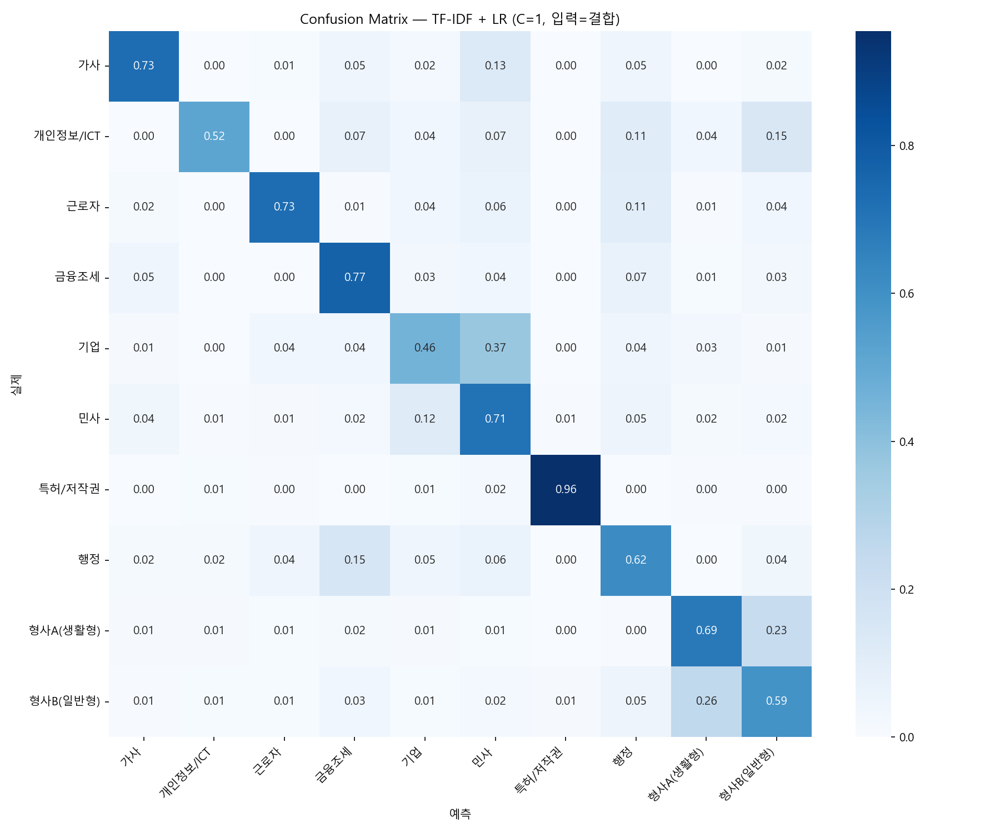

- **잘 분류**: 특허/저작권(0.96), 금융조세(0.77), 가사(0.73), 근로자(0.73)
- **취약**: 기업(0.46, 민사로 흡수), 형사A↔형사B(상호 0.23~0.26 혼동), 개인정보/ICT(0.52)
→ BERT 문맥 모델로 개선 여지 확인(다음 단계 동기)

### 5.3 TextCNN (학습 임베딩)

> 노트북: [`textcnn/textcnn.ipynb`](textcnn/textcnn.ipynb)

- **임베딩**: 사전학습 한국어 fastText(`cc.ko.300.vec`, 300차원)로 초기화, OOV는 랜덤 초기화
- **토큰화**: 정규식 정제 후 공백 분리
- **구조**: kernel size {3, 4, 5} × 100 filters → max-pooling → concat → Dropout(0.3) → FC
- **학습**: Adam(lr=1e-3), `class_weight` 적용, 최대 40 epoch, early stopping(patience=6)
- **어휘**: train 기준 vocab 117,110개, fastText 매칭률 **31.9%** (법률 도메인 특화 어휘 다수로 인한 자연스러운 결과)

### 5.4 KLUE-BERT(frozen) + MLP (사전학습 문맥)

> 노트북: [`bert/extract_embeddings.ipynb`](bert/extract_embeddings.ipynb), [`bert/bert_mlp.ipynb`](bert/bert_mlp.ipynb)

**2단계 구조:**

1. **임베딩 추출** (`extract_embeddings.ipynb`): `klue/bert-base`를 frozen으로 사용, 입력을 512 토큰으로 truncation 후 `[CLS]` 토큰의 **768차원 벡터**를 추출하여 `.npy`로 캐싱. train 34,080건 추출에 약 **154초** 소요.
2. **MLP 분류** (`bert_mlp.ipynb`): 768 → 256 → 64 → 10, ReLU, Dropout(0.3), `class_weight` 적용, Adam(lr=1e-3), 최대 60 epoch, early stopping(patience=7).

**Frozen 선정 이유:**
- 사전학습 가중치를 그대로 사용 → "표현 방식"의 효과만 공정하게 비교(fine-tuning으로 BERT만 유리해지는 것 방지)
- 임베딩 1회 추출 후 캐싱 → 실험 반복 속도 향상

> 교수 피드백 ②를 반영하여, "512 토큰 한계"는 EDA의 데이터 관찰 근거로만 사용하고 모델 설계의 핵심 근거로는 사용하지 않는다. 분류기 입장에서 입력은 "고정 768차원 벡터 1개"일 뿐이다.

### 5.5 Late Fusion (앙상블)

> 노트북: [`hybrid/late_fusion.ipynb`](hybrid/late_fusion.ipynb)

두 모델을 각자 학습시킨 뒤 **예측 확률을 가중 평균**한다.

```
P_final = α · P(TF-IDF + LR) + (1 − α) · P(BERT + MLP)

α ∈ {0.0, 0.1, ..., 1.0}  →  검증셋(val)에서 최적 α 탐색
최종 예측 = argmax(P_final)
```

- **왜 LR인가**: SVM(LinearSVC)은 확률 출력이 까다로워, 확률이 깔끔한 LR을 융합 대상으로 사용
- **왜 Late Fusion인가**: TF-IDF(10,000차원) ↔ BERT(768차원)의 차원 격차로 인한 신호 묻힘(Early Fusion의 문제)을 피하고, 결정 단계에서 결합 → 차원 충돌 없음

### 5.6 평가 지표

- **주요 지표: Macro F1** (클래스 불균형 56배 → Accuracy 단독은 신뢰 불가)
- 보조 지표: Accuracy, Precision, Recall, 클래스별 Confusion Matrix

### 5.7 실험 환경

| 항목 | 내용 |
|---|---|
| 플랫폼 | RunPod (GPU), Network Volume 50GB |
| GPU | NVIDIA RTX PRO 4500 (32GB VRAM) |
| 프레임워크 | PyTorch, scikit-learn, transformers 4.44.2, gensim |
| 사전학습 모델 | `klue/bert-base`, fastText `cc.ko.300.vec` |
| 순수 GPU 학습 시간 | 약 10~20분 (임베딩 추출) + 모델별 수~수십 분 |

---

## 6. 실험 결과

> **그림 출처 안내**
> * `artifacts/` — 노트북 실행 시 **자동 저장된 공식 결과 그래프** (본 실험 산출물)
> * `report_images/` — RunPod 실험 **실행 화면 캡처** (과정·수치 확인용)

### 6.1 전체 모델 비교

| # | 모델 | 계열 | 입력 | Accuracy | **Macro F1** | 베이스라인 대비 |
|:--:|---|---|---|---:|---:|:--:|
| 1 | TF-IDF + LR (튜닝) | 전통 ML | 결합 | 0.689 | 0.6253 | 기준 이하 |
| 2 | TF-IDF + SVM (튜닝) | 전통 ML | 결합 | 0.724 | 0.6347 | **기준선** |
| 3 | **TextCNN** | 딥러닝(학습임베딩) | 결합 | **0.7261** | **0.6556** | ▲ +0.021 |
| 4 | KLUE-BERT(frozen)+MLP | 딥러닝(문맥) | 결합 | 0.6163 | 0.5792 | ▼ −0.056 |
| 5 | **Late Fusion (α=0.8)** | 앙상블 | 결합 | 0.7073 | **0.6561** | ▲ +0.021 |

> 모든 수치는 **전체 test 4,261건** 기준이며, `bert/bert_mlp.ipynb`·`textcnn/textcnn.ipynb`·`hybrid/late_fusion.ipynb` 저장 출력과 일치한다.

**핵심 관찰:**
- **TextCNN(0.6556)·Late Fusion(0.6561)** 이 베이스라인(0.6347) 상회 → H1 **부분 지지**
- **BERT+MLP 단독(0.5792)** 은 baseline **미달** → frozen BERT+경량 MLP만으로는 어휘 기반 SVM을 넘기지 못함
- 전체 test 최고 성능은 **Late Fusion(0.6561)** 과 **TextCNN(0.6556)** 으로 사실상 동률
- Late Fusion은 BERT+MLP 단독보다 **+0.077** 개선 → 문맥 신호를 LR과 결합할 때만 BERT 계열의 가치가 드러남 (H3, 7.3 논의)

### 6.1.1 본 실험 공식 산출물 (`artifacts/`)

RunPod 실험 중 노트북이 **자동 저장**한 공식 결과 그래프 2종이다. (스크린샷 `report_images/`와 별도)

**① BERT+MLP Confusion Matrix** — `bert/bert_mlp.ipynb` 실행 시 저장 (test 4,261건, F1-macro 0.579)

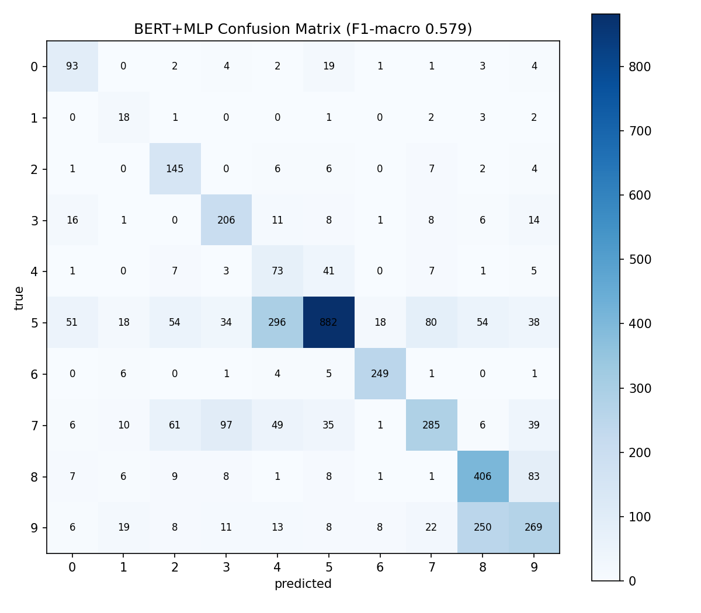

**② Late Fusion α vs val F1 그래프** — `hybrid/late_fusion.ipynb` 실행 시 저장 (best α=0.8)

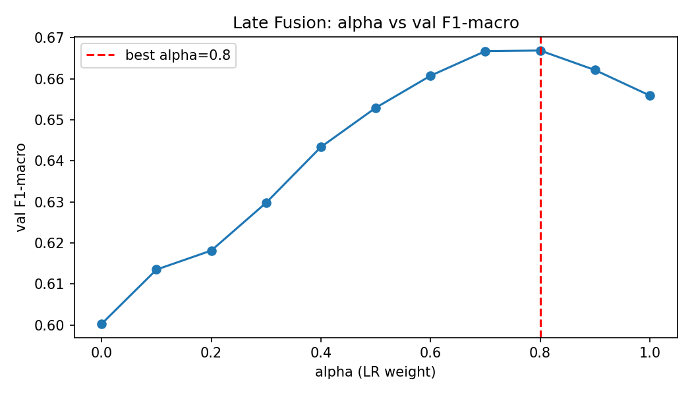

### 6.2 TextCNN 클래스별 성능 (전체 test 4,261건)

노트북 [`textcnn/textcnn.ipynb`](textcnn/textcnn.ipynb) 기준. fastText 사전학습 임베딩 + TextCNN으로 **Macro F1 0.6556**, baseline(0.6347) **상회**.

**전처리 — fastText 매칭 (vocab 117,110 / 매칭 31.9%):**

법률 도메인 특화 어휘가 많아 fastText 매칭률은 31.9%에 그치나, 이는 본 도메인에서 자연스러운 수치이다.

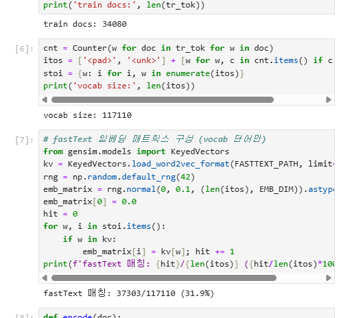

**최종 평가 (Accuracy 0.7261 / Macro F1 0.6556, test 4,261건):**

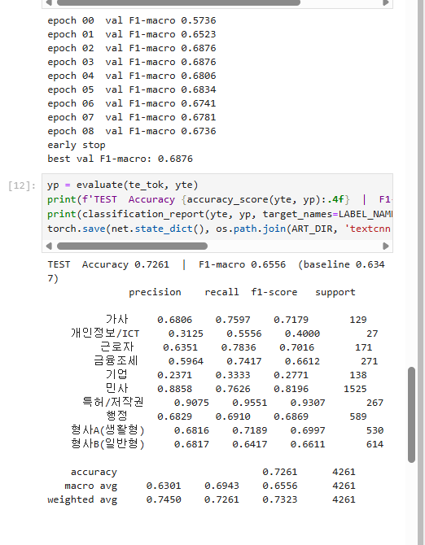

| 카테고리 | Precision | Recall | F1 | Support |
|---|---:|---:|---:|---:|
| 가사 | 0.6806 | 0.7597 | 0.7179 | 129 |
| 개인정보/ICT | 0.3125 | 0.5556 | 0.4000 | 27 |
| 근로자 | 0.6351 | 0.7836 | 0.7016 | 171 |
| 금융조세 | 0.5964 | 0.7417 | 0.6612 | 271 |
| **기업** | 0.2371 | 0.3333 | **0.2771** | 138 |
| 민사 | 0.8858 | 0.7626 | 0.7985 | 1,525 |
| **특허/저작권** | 0.9075 | 0.9551 | **0.9307** | 267 |
| 행정 | 0.6829 | 0.6910 | 0.6869 | 589 |
| 형사A(생활형) | 0.6816 | 0.7189 | 0.6997 | 530 |
| 형사B(일반형) | 0.6817 | 0.6417 | 0.6611 | 614 |
| **macro avg** | 0.6251 | 0.6943 | **0.6556** | 4,261 |

### 6.3 BERT+MLP 클래스별 성능 (전체 test 4,261건)

노트북 [`bert/bert_mlp.ipynb`](bert/bert_mlp.ipynb) 최종 저장 출력 기준. test **4,261건** 전체로 평가하였으며, **Macro F1 0.5792**로 baseline(0.6347) **미달**이다.

**학습 과정 (early stopping, best val Macro F1 0.6003):**

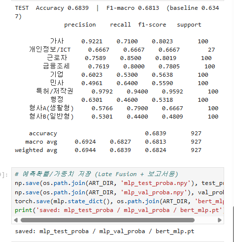

val에서 0.6003까지 올랐으나 test에서는 0.5792로 하락 → frozen BERT+경량 MLP만으로는 일반화가 baseline까지 이어지지 못함.

**최종 평가 (Accuracy 0.6163 / Macro F1 0.5792):**

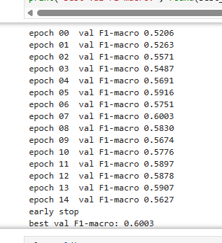

| 카테고리 | Precision | Recall | F1 | Support |
|---|---:|---:|---:|---:|
| 가사 | 0.5138 | 0.7209 | 0.6000 | 129 |
| 개인정보/ICT | 0.2308 | 0.6667 | 0.3429 | 27 |
| 근로자 | 0.5052 | 0.8480 | 0.6332 | 171 |
| 금융조세 | 0.5659 | 0.7601 | 0.6488 | 271 |
| **기업** | 0.1604 | 0.5290 | **0.2462** | 138 |
| 민사 | 0.8707 | 0.5784 | 0.6950 | 1,525 |
| **특허/저작권** | 0.8925 | 0.9326 | **0.9121** | 267 |
| 행정 | 0.6884 | 0.4839 | 0.5683 | 589 |
| 형사A(생활형) | 0.5554 | 0.7660 | 0.6439 | 530 |
| **형사B(일반형)** | 0.5861 | 0.4381 | **0.5014** | 614 |
| **macro avg** | 0.5569 | 0.6724 | **0.5792** | 4,261 |

**Confusion Matrix (위 [6.1.1①](#611-본-실험-공식-산출물-artifacts)와 동일 파일):**

`artifacts/confusion_matrix_bert_mlp.png` — 대각선(정분류)은 특허/저작권·근로자 등에서 두드러지나, **기업→민사·형사B→형사A** 오분류가 baseline과 동일하게 나타난다.

### 6.4 Late Fusion: α 탐색 및 클래스별 성능

노트북 [`hybrid/late_fusion.ipynb`](hybrid/late_fusion.ipynb) 기준. LR(어휘)과 BERT+MLP(문맥) 확률을 가중합하여 **baseline(0.6347)과 BERT+MLP 단독(0.5792) 모두를 넘기는** Macro F1 **0.6561**을 달성하였다.

**α 그리드 탐색 (실행 화면, best α=0.8 / val Macro F1 0.6669):**

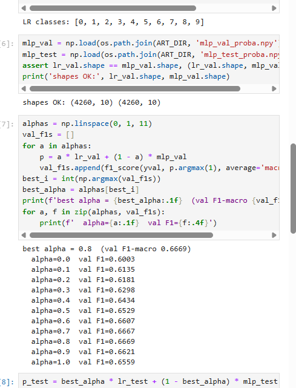

α=0.0(MLP만 0.6003) → α=0.8(최적 0.6669) → α=1.0(LR만 0.6559). **LR 가중치 80%** 일 때 val 최고 → 어휘 신호가 주력, BERT+MLP는 보조.

**α vs val F1 그래프 (위 [6.1.1②](#611-본-실험-공식-산출물-artifacts)와 동일 파일):**

`artifacts/late_fusion_alpha.png` — α=0.8에서 val F1 peak, α=1.0(LR 단독)에서 급락 → MLP 신호 **20%** 보조가 최적.

**최종 test 평가 (α=0.8, Accuracy 0.7073 / Macro F1 0.6561):**

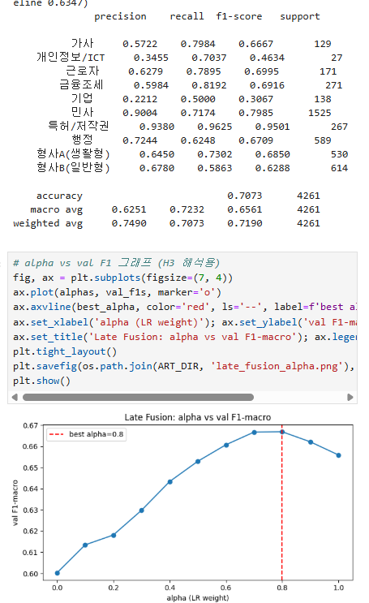

| 카테고리 | Precision | Recall | F1 | Support |
|---|---:|---:|---:|---:|
| 가사 | 0.5722 | 0.7984 | 0.6667 | 129 |
| 개인정보/ICT | 0.3455 | 0.7037 | 0.4634 | 27 |
| 근로자 | 0.6279 | 0.7895 | 0.6995 | 171 |
| 금융조세 | 0.5984 | 0.8192 | 0.6916 | 271 |
| **기업** | 0.2212 | 0.5000 | **0.3067** | 138 |
| 민사 | 0.9004 | 0.7174 | 0.7985 | 1,525 |
| **특허/저작권** | 0.9380 | 0.9625 | **0.9501** | 267 |
| 행정 | 0.7244 | 0.6248 | 0.6709 | 589 |
| 형사A(생활형) | 0.6450 | 0.7302 | 0.6850 | 530 |
| 형사B(일반형) | 0.6780 | 0.5863 | 0.6288 | 614 |
| **macro avg** | 0.6251 | 0.7232 | **0.6561** | 4,261 |

**α 탐색 수치 요약 (val):**

| α (LR 가중치) | 0.0 (MLP만) | 0.4 | **0.8 (최적)** | 1.0 (LR만) |
|---|---:|---:|---:|---:|
| val Macro F1 | 0.6003 | 0.6434 | **0.6669** | 0.6559 |

→ Late Fusion은 BERT+MLP 단독(0.5792)보다 **+0.077**, TextCNN(0.6556)과는 **+0.0005** 로 사실상 동률.

---

## 7. 논의

### 7.1 H1 — 표현 방식에 따른 성능 차이 (부분 지지)

베이스라인(희소 빈도, 0.6347) 대비 **학습 임베딩(TextCNN, 0.6556)** 과 **앙상블(Late Fusion, 0.6561)** 은 상회하였으나, **사전학습 문맥(BERT+MLP, 0.5792)** 은 **baseline 미달**이었다. 즉 "표현 방식에 따라 성능 차이가 있다"는 H1은 지지되지만, **frozen BERT+경량 MLP만으로는 TF-IDF 기반 전통 ML을 자동으로 능가하지는 못한다**는 점이 드러났다. TextCNN이 BERT+MLP보다 우수한 것은 fastText 도메인 어휘 + CNN n-gram이 판례 키워드 분류에 더 적합했기 때문으로 해석할 수 있다.

### 7.2 BERT+MLP 단독 baseline 미달 해석

- **val Macro F1 0.6003 vs test 0.5792**: 검증·평가 모두 baseline(0.6347) 미달
- frozen `[CLS]` 벡터 1개만 사용 → 512 토큰 truncation으로 긴 판시사항 정보 손실
- MLP(768→256→64→10)는 BERT 표현을 충분히 활용하지 못할 수 있음
- **Late Fusion에서 α=0.8(LR 80%)** 이 최적 → test에서도 **어휘(LR) 신호가 주력**, BERT+MLP(20%)는 보조
- 따라서 BERT 계열의 기여는 **단독 분류기보다 앙상블 보조 신호**로서 더 적합

### 7.3 H2 — 결합 입력의 우수성 (지지)

베이스라인 단계에서 결합 입력이 판시사항·요약문 단일 입력을 모든 모델에서 능가하였다(예: TF-IDF+LR 0.6237 vs 0.5893 vs 0.5207). 이에 따라 본 실험의 모든 모델은 결합 입력을 표준으로 채택하였다.

### 7.4 H3 — Late Fusion의 효과 (부분 지지)

- **검증셋 기준**: Late Fusion(0.6669)이 순수 LR(0.6559)·순수 MLP(0.6003)를 모두 상회 → 명확한 상호 보완
- **평가셋 기준**: Late Fusion(0.6561)은 TextCNN(0.6556)과 사실상 동률이나, **BERT+MLP 단독(0.5792) 대비 +0.077** 로 큰 폭 개선

즉 Late Fusion의 핵심 가치는 **"BERT+MLP 단독의 약점을 LR과 결합해 baseline 이상으로 끌어올린다"** 는 점이다. 다만 TextCNN 단독과 비교하면 추가 이득은 근소하다(H3 부분 지지).

### 7.5 클래스별 강·약점 (표현 방식 무관 공통 패턴)

| 유형 | 클래스 | 모든 모델 공통 경향 |
|---|---|---|
| **쉬운 클래스** | 특허/저작권 | F1 0.93~0.96 — 도메인 용어 변별력이 압도적 |
| | 민사 | 다수 클래스 + 어휘 풍부 → 안정적 |
| **어려운 클래스** | **기업** | 민사로 흡수 오분류 빈번 → BERT+MLP F1 **0.25**, TextCNN **0.28** |
| | 형사A ↔ 형사B | 같은 형사 도메인, 상호 혼동 |
| | 개인정보/ICT | 극소수(0.6%) 샘플 → 학습 부족 |

→ **오분류의 원인이 모델이 아니라 데이터(클래스 의미 인접성·불균형)에 있음**을 시사한다. EDA의 유사도 히트맵에서 예고된 패턴과 정확히 일치한다.

### 7.6 실험이 빠르게 종료된 이유

전체 본 실험이 비교적 짧은 시간에 완료된 것은 설계상 자연스러운 결과이다.
- BERT를 **fine-tuning하지 않고 추출만** 수행(학습 0회)
- MLP·TextCNN은 **파라미터가 적은 경량 모델**이며 early stopping이 작동(TextCNN 9 epoch, MLP 15 epoch에서 조기 종료)
- GPU 가속 사용

---

## 8. 한계 및 향후 과제

1. **소수 클래스 성능**: 개인정보/ICT(0.6%) 등 극소수 클래스는 `class_weight`만으로 한계가 있어, 오버샘플링·데이터 증강·focal loss 등의 적용이 필요하다.
2. **Frozen BERT+MLP 한계**: fine-tuning 없이 `[CLS]` 벡터 + 경량 MLP만으로는 test Macro F1 **0.5792**로 baseline 미달. fine-tuning 또는 더 큰 분류 헤드·다른 pooling 전략 검토 필요.
3. **입력 잘림**: 512 토큰 초과 문서의 정보 손실 → sliding window·요약 기반 입력 등의 대안 검토 가능.

---

## 9. 결론

본 연구는 판례 텍스트 10-클래스 분류에서 **텍스트 표현 방식이 성능에 미치는 영향**을 동일 조건 하에서 비교하였다. 핵심 결론은 다음과 같다.

1. **TextCNN(0.6556)·Late Fusion(0.6561)** 이 baseline(0.6347)을 상회하였으나, **BERT+MLP 단독(0.5792)** 은 baseline 미달 → H1 **부분 지지**.
2. **결합 입력**이 단일 입력보다 일관되게 우수하였다(H2 지지).
3. **Late Fusion**은 BERT+MLP 단독 대비 크게 개선(+0.077)되었으나 TextCNN과는 동률 수준 → BERT 신호는 **앙상블 보조**로서 더 유효(H3 부분 지지).
4. 오분류 패턴은 모델 종류와 무관하게 **클래스 의미 인접성·불균형**이라는 데이터 본질에서 비롯되었다.

**모델 선정 관점 (test 4,261건 기준)**

| 관점 | 선정 모델 | Macro F1 | 비고 |
|---|---|---:|---|
| 수치상 최고 | Late Fusion (α=0.8) | **0.6561** | LR 80% + BERT+MLP 20% |
| 비용 대비 실용 | **TextCNN** | 0.6556 | Late Fusion과 **+0.0005** 차이로 실질 동률 |
| 해석 가능 baseline | TF-IDF + SVM | 0.6347 | GridSearchCV 튜닝 후 기준선 |
| 후속 연구 대상 | BERT fine-tuning / Legal-BERT | 0.5792 (frozen 단독) | 도메인 적응·truncation 보완 필요 |

수치상 최고는 **Late Fusion(0.6561)** 이지만 TextCNN(0.6556)과 차이가 0.0005로 매우 작아 **실질적으로 동률**이다. 구현 복잡도·추론 파이프라인 단순성을 고려하면 **TextCNN이 비용 대비 가장 실용적인 선택**이다.

---

## 10. 재현 방법 (Reproducibility)

> 상세 실행 가이드: [`RUN_GUIDE.md`](RUN_GUIDE.md)

### 10.1 환경 준비 (RunPod / GPU)

```bash
git clone https://github.com/Raewon12/big_data_programming-LEON.git
cd big_data_programming-LEON
pip install -r requirements-runpod.txt   # RunPod PyTorch 템플릿 (torch 사전 설치)
# 로컬 CPU: pip install -r requirements-cpu.txt
```

> **원본 데이터**: AI Hub 「상황에 따른 판례」 JSON은 라이선스상 저장소에 포함되지 않습니다. 저장소의 `processed_data/`는 전처리 완료본이며, 재생성은 `python preprocess/make_processed_data.py --json-dir <경로>`를 사용하세요.

### 10.2 fastText 임베딩 다운로드 (TextCNN용, 약 1.3GB)

```bash
mkdir -p artifacts && cd artifacts
wget https://dl.fbaipublicfiles.com/fasttext/vectors-crawl/cc.ko.300.vec.gz
gunzip cc.ko.300.vec.gz && cd ..
```

### 10.3 실험 실행 순서 (의존 관계 준수)

```
extract_embeddings.ipynb  →  bert_mlp.ipynb  →  late_fusion.ipynb
                                                       ↑
textcnn.ipynb (독립, 언제든 실행 가능) ─────────────────┘
```

| 순서 | 노트북 | 산출물 |
|:--:|---|---|
| 1 | `bert/extract_embeddings.ipynb` | `artifacts/bert_*_X.npy` |
| 2 | `bert/bert_mlp.ipynb` | test Macro F1 + `mlp_*_proba.npy` |
| 3 | `textcnn/textcnn.ipynb` | test Macro F1 |
| 4 | `hybrid/late_fusion.ipynb` | 최적 α + Fusion test Macro F1 |

> 각 노트북 첫 셀의 `SMOKE_TEST = True`로 약 1,000건 파이프라인 점검 후, `False`로 본 실험을 수행한다.

### 10.4 폴더 구조

```
.
├── EDA/                  # EDA 노트북 + 시각화 PNG
├── baseline/             # TF-IDF + LR/SVM + Confusion Matrix
├── bert/                 # extract_embeddings + bert_mlp 노트북
├── textcnn/              # TextCNN 노트북
├── hybrid/               # Late Fusion 노트북
├── artifacts/            # 실험 산출물 (공식 PNG 2종 + *.npy/*.pt는 .gitignore)
│   ├── confusion_matrix_bert_mlp.png   # BERT+MLP 혼동 행렬 (공식)
│   └── late_fusion_alpha.png            # Late Fusion α 그래프 (공식)
├── report_images/        # 실험 실행 화면 캡처 (README 보조)
├── preprocess/           # make_processed_data.py (JSON→CSV)
├── processed_data/       # train/val/test/label_mapping
├── 산출물/               # 최종보고서·체크리스트·모델 구성 문서
├── requirements-runpod.txt / requirements-cpu.txt
├── RUN_GUIDE.md          # RunPod 실행 가이드
└── README.md             # 본 보고서
```

---

## 11. 팀 구성 및 역할

| 이름 | 역할 |
|---|---|
| 정래원 | 결과 분석 및 보고서 |
| 김동현 | Baseline 모델 (TF-IDF + LR/SVM) |
| 김홍근 | BERT + MLP / TextCNN / Late Fusion(하이브리드) |
| 이승준 | 데이터 전처리 |
| 이윤수 | EDA 및 시각화 |

---

## 참고문헌

1. Devlin, J., Chang, M.-W., Lee, K., & Toutanova, K. (2019). *BERT: Pre-training of Deep Bidirectional Transformers for Language Understanding.* NAACL.
2. Park, S., et al. (2021). *KLUE: Korean Language Understanding Evaluation.* NeurIPS Datasets and Benchmarks.
3. Kim, Y. (2014). *Convolutional Neural Networks for Sentence Classification.* EMNLP.
4. Bojanowski, P., Grave, E., Joulin, A., & Mikolov, T. (2017). *Enriching Word Vectors with Subword Information (fastText).* TACL.
5. AI Hub. 「상황에 따른 판례」 데이터셋. https://aihub.or.kr

---

## 부록 A. 트러블슈팅 기록

> 상세: [`troubleshooting.md`](troubleshooting.md)

| 문제 | 원인 | 해결 |
|---|---|---|
| `transformers` import 시 `ModuleNotFoundError` | 최신 transformers ↔ RunPod torch 버전 충돌 | `transformers==4.44.2`로 고정 |
| `KeyError: 'label'` | CSV에 `label` 컬럼 부재(`class_name`만 존재) | `label_mapping.csv`로 라벨 복원하도록 `load_split` 보강 |
| 스모크 테스트 시 재차 `KeyError: 'label'` | 최신 pandas의 `groupby().apply()`가 그룹 키 컬럼 제거 | 그룹별 `sample` 후 `pd.concat`으로 변경 |
| Late Fusion `ValueError: shapes (4261,10) (927,10)` | `mlp_test_proba.npy`가 스모크(927건) 버전 잔존 | 전체 데이터로 `bert_mlp.ipynb` 재실행 후 proba 재생성 |
| GPU 미호환 경고 (RTX PRO 4500 Blackwell sm_120) | PyTorch 빌드가 신형 아키텍처 미지원 | 경고 무시 가능(연산 정상), 필요 시 PyTorch 재설치 |
| `git push` 인증 실패 | GitHub 비밀번호 인증 폐지 | Personal Access Token(PAT) 사용 |
